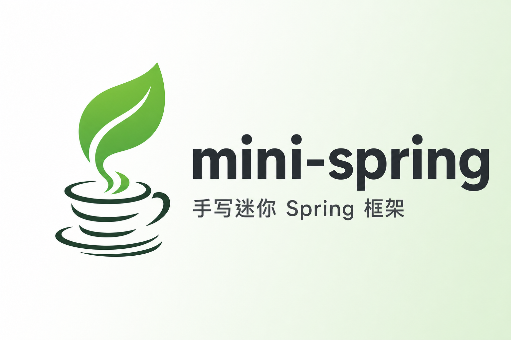
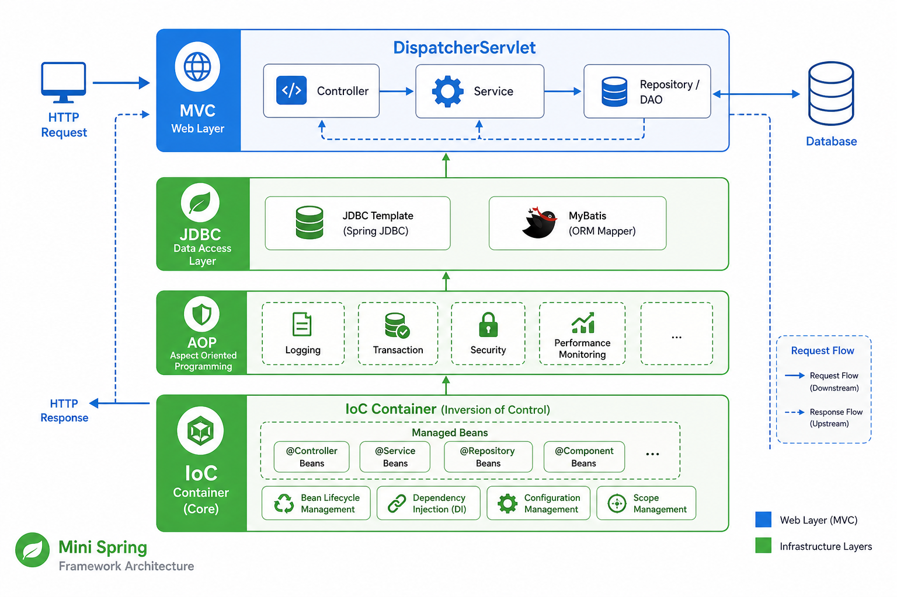
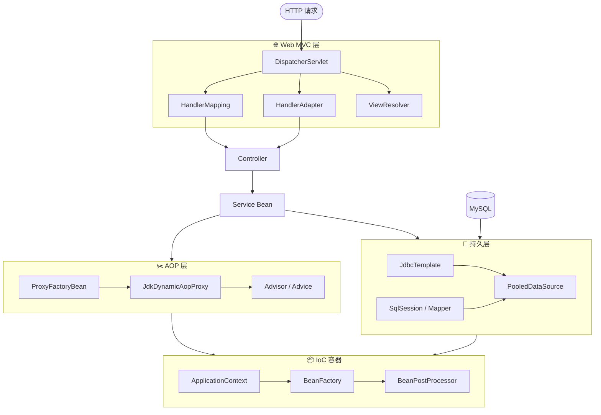
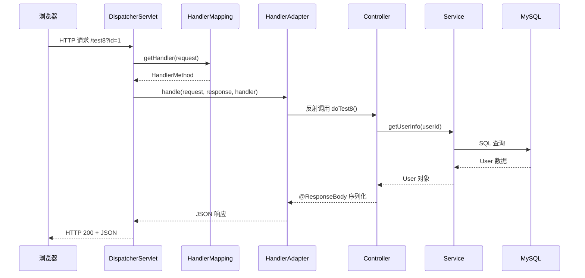
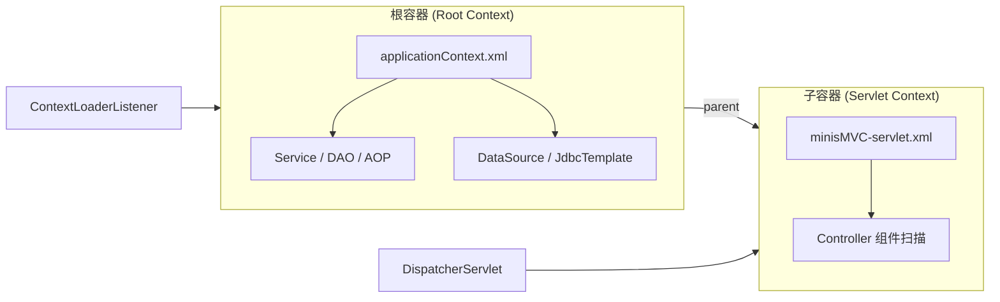
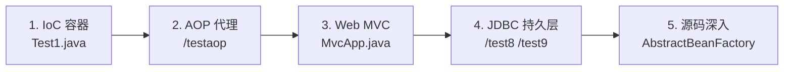

<p align="center">
  
</p>

<p align="center">
  
  
  
  
</p>

<h1 align="center">mini-spring</h1>

<p align="center"><strong>从零手写迷你 Spring 框架 —— 深入理解 IoC、AOP、MVC 与持久层</strong></p>

<p align="center">
  <a href="#-项目简介">简介</a> •
  <a href="#-整体架构">架构</a> •
  <a href="#-核心模块">模块</a> •
  <a href="#-快速开始">快速开始</a> •
  <a href="#-测试接口">测试接口</a> •
  <a href="#-项目结构">目录结构</a>
</p>

---

## 📖 项目简介

**mini-spring** 是一个教学向的轻量级 Java 框架，从零实现了 Spring 框架的核心能力。项目不依赖 Spring 官方库，而是通过手写代码复刻了以下关键机制：

| 能力 | 说明 |
|------|------|
| **IoC 容器** | XML 配置、Bean 定义、依赖注入、生命周期管理 |
| **AOP** | JDK 动态代理、Advisor、Before Advice、自动代理创建 |
| **Web MVC** | DispatcherServlet、@RequestMapping、视图解析、JSON 响应 |
| **持久层** | JdbcTemplate、连接池、类 MyBatis 的 SqlSession |
| **扩展机制** | BeanPostProcessor、BeanFactoryPostProcessor、事件监听 |

> 💡 适合 Java 开发者系统学习 Spring 底层原理，也可作为框架设计参考。

---

## 🏗 整体架构

<p align="center">
  
</p>

框架采用经典的分层设计，自底向上依次为 **IoC 容器 → AOP → 持久层 → Web MVC**：



### 请求处理流程



---

## 🧩 核心模块

### 1️⃣ IoC 容器（beans / context）

```
BeanDefinition → XmlBeanDefinitionReader → AbstractBeanFactory → ApplicationContext
```

- **XML 配置**：通过 `applicationContext.xml` 声明 Bean
- **依赖注入**：支持构造器注入、Setter 注入、`@Autowired` 字段注入
- **生命周期**：`init-method`、BeanPostProcessor 前后置处理
- **单例管理**：`DefaultSingletonBeanRegistry` 维护 Bean 实例

```java
// 独立运行 IoC 容器测试
ClassPathXmlApplicationContext ctx =
    new ClassPathXmlApplicationContext("applicationContext.xml");
AService aService = (AService) ctx.getBean("aservice");
aService.sayHello();
```

### 2️⃣ AOP 面向切面（aop）

- **JDK 动态代理**：`JdkDynamicAopProxy` 实现方法拦截
- **Advisor 模式**：`NameMatchMethodPointcutAdvisor` 按方法名匹配切点
- **自动代理**：`BeanNameAutoProxyCreator` 对 `action*` Bean 自动织入代理
- **Advice 类型**：BeforeAdvice、AfterReturningAdvice、MethodInterceptor

```xml
<!-- applicationContext.xml 中的 AOP 配置示例 -->
<bean id="autoProxyCreator"
      class="com.lppnb.minis.aop.framework.autoproxy.BeanNameAutoProxyCreator">
    <property name="pattern" value="action*" />
    <property name="interceptorName" value="advisor" />
</bean>
```

### 3️⃣ Web MVC（web）

| 组件 | 类 | 职责 |
|------|-----|------|
| 前端控制器 | `DispatcherServlet` | 统一请求入口，协调各组件 |
| 映射器 | `RequestMappingHandlerMapping` | 解析 `@RequestMapping` 路由 |
| 适配器 | `RequestMappingHandlerAdapter` | 参数绑定、方法调用、返回值处理 |
| 视图解析 | `InternalResourceViewResolver` | JSP 视图渲染 |
| 消息转换 | `DefaultHttpMessageConverter` | JSON 序列化 / 反序列化 |

```java
@RequestMapping("/test7")
@ResponseBody
public User doTest7(User user) {
    user.setName(user.getName() + "---");
    user.setBirthday(new Date());
    return user;  // 自动序列化为 JSON
}
```

### 4️⃣ 持久层（jdbc / batis）

- **JdbcTemplate**：模板方法模式封装 JDBC 操作
- **PooledDataSource**：简易数据库连接池
- **SqlSession**：类 MyBatis 的 Mapper XML 解析与 SQL 执行

---

## 🚀 快速开始

### 环境要求

| 依赖 | 版本 |
|------|------|
| JDK | 8+ |
| Maven | 3.6+ |
| MySQL | 5.7+ / 8.0（可选，用于 JDBC 测试） |

### 1. 克隆项目

```bash
git clone <your-repo-url>
cd mini-spring
```

### 2. 编译项目

```bash
mvn clean compile
```

### 3. 配置数据库（可选）

编辑 `src/main/resources/applicationContext.xml`，修改数据源连接信息：

```xml
<bean id="dataSource" class="com.lppnb.minis.jdbc.pool.PooledDataSource">
    <property name="url" value="jdbc:mysql://localhost:3306/DEMO?useSSL=false&amp;serverTimezone=UTC"/>
    <property name="driverClassName" value="com.mysql.cj.jdbc.Driver"/>
    <property name="username" value="root"/>
    <property name="password" value="your_mysql_password"/>
    <property name="initialSize" value="3"/>
</bean>
```

建表 SQL 参考：

```sql
CREATE DATABASE IF NOT EXISTS DEMO;
USE DEMO;

CREATE TABLE users (
    id       INT PRIMARY KEY,
    name     VARCHAR(100),
    birthday DATE
);

INSERT INTO users VALUES (1, 'Alice', '2000-01-01');
```

### 4. 启动 Web 应用

运行嵌入式 Tomcat 启动类：

```bash
# 在 IDE 中运行，或使用 Maven exec 插件
# 主类：com.lppnb.minis.test.MvcApp
```

启动后访问：**http://localhost:8080**

### 5. 独立测试 IoC 容器

```bash
# 主类：com.lppnb.minis.test.Test1
# 无需启动 Tomcat，直接验证 Bean 加载与依赖注入
```

---

## 🔗 测试接口

启动 `MvcApp` 后，可通过以下接口验证各模块功能：

| 接口 | 方法 | 功能 | 示例 |
|------|------|------|------|
| `/test2` | GET | 直接写响应 | `curl http://localhost:8080/test2` |
| `/test5?name=Tom` | GET | JSP 视图渲染 | 浏览器访问，返回 test.jsp |
| `/test6?name=Tom` | GET | 错误页视图 | 返回 error.jsp |
| `/test7?name=Tom&birthday=2000/01/01` | GET | JSON 响应（参数绑定） | 返回 User JSON |
| `/test8?id=1` | GET | JDBC 查询单条 | 需要 MySQL |
| `/test9?id=1` | GET | JDBC 查询列表 | 需要 MySQL |
| `/testaop` | GET | AOP 拦截 doAction() | 控制台输出 Advice 日志 |
| `/testaop2` | GET | AOP 不拦截 doSomething() | 验证切点匹配 |
| `/testaop3` | GET | 自动代理 action2 | 验证 BeanNameAutoProxyCreator |
| `/testaop4` | GET | action2 非切点方法 | 验证切点精确匹配 |

### 接口响应示例

**JSON 接口** `/test7?name=Hello&birthday=2000/01/01`：

```json
{
  "id": 1,
  "name": "Hello---",
  "birthday": "2000/01/01"
}
```

**纯文本接口** `/test2`：

```
test 2, hello world!
```

---

## 📁 项目结构

```
mini-spring/
├── docs/
│   └── assets/                  # 文档图片资源
│       ├── banner.png
│       └── architecture.png
├── src/main/
│   ├── java/com/lppnb/minis/
│   │   ├── aop/                 # AOP 代理与切面
│   │   ├── batis/               # 类 MyBatis SqlSession
│   │   ├── beans/               # IoC 核心（BeanFactory、DI）
│   │   ├── context/             # ApplicationContext
│   │   ├── core/env/            # 环境抽象
│   │   ├── http/converter/      # HTTP 消息转换
│   │   ├── jdbc/                # JDBC 模板与连接池
│   │   ├── util/                # 工具类
│   │   ├── web/                 # MVC 框架
│   │   └── test/                # 示例与启动类
│   └── resources/
│       ├── applicationContext.xml   # 根容器配置
│       ├── mapper/User_Mapper.xml   # Mapper 配置
│       └── logback.xml
├── WebContent/
│   ├── WEB-INF/
│   │   ├── web.xml                  # Servlet 配置
│   │   └── minisMVC-servlet.xml     # MVC 子容器（组件扫描）
│   └── jsp/                         # JSP 视图
├── pom.xml
└── README.md
```

### 双容器模型



- **根容器**：由 `ContextLoaderListener` 加载，管理 Service、DAO、AOP 等
- **子容器**：由 `DispatcherServlet` 加载，仅扫描 Controller
- Controller 可通过 `@Autowired` 注入根容器中的 Bean

---

## 🛠 技术栈

| 类别 | 技术 |
|------|------|
| 语言 | Java 8 |
| 构建 | Maven |
| Web 容器 | Embedded Tomcat 9.0.85 |
| XML 解析 | dom4j |
| 数据库 | MySQL 8.x |
| 日志 | SLF4J + Logback |
| 工具 | Lombok |

---

## 📚 学习路线建议



1. **IoC 入门** — 运行 `Test1`，理解 XML 配置与 Bean 获取
2. **AOP 实践** — 访问 `/testaop` 系列接口，观察控制台 Advice 输出
3. **MVC 体验** — 启动 `MvcApp`，测试视图渲染与 JSON 响应
4. **持久层** — 配置 MySQL，测试 `/test8`、`/test9` 数据查询
5. **源码阅读** — 从 `AbstractBeanFactory.getBean()` 和 `DispatcherServlet.doDispatch()` 入手

---

## ⚠️ 注意事项

- 本项目为**学习用途**，部分实现做了简化，不适用于生产环境
- 数据库密码等敏感信息请在本地修改，**不要提交到版本库**
- `@Autowired` 当前按**字段名 = Bean id** 匹配，尚未实现按类型匹配
- AOP 仅支持 **JDK 动态代理**（目标类需实现接口）

---

## 📄 License

本项目仅供学习交流使用。

---

<p align="center">
  <sub>如果这个项目对你有帮助，欢迎 ⭐ Star 支持！</sub>
</p>
